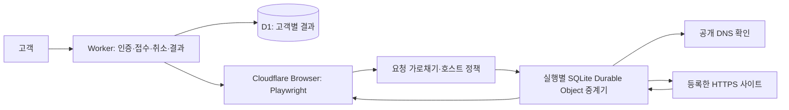

# RepliQA 0.2.7 브라우저 실행·네트워크 중계 개선

2026-09-18. **운영 파일럿을 0.2.7로 배포했다.** 실제 Cloudflare Free에 배포한 중계기로 GitHub Docs와 Next.js의 기존 9단계 여정을 모두 통과했다. 자원이 많은 페이지에서 발생하던 Worker의 외부 요청 수 제한을 해결한 결과다. 사이트 전체의 결함 탐지 정확도나 경쟁 제품 대비 우위를 입증한 결과는 아니다.

## 구조

기존에는 페이지의 자원 요청과 DNS 확인을 한 Worker 실행에서 처리해 Free의 외부 하위 요청 한도에 도달했다. 이제 각 자원 요청을 실행 전용 Durable Object의 별도 호출로 전달한다. 중계기가 DNS·호스트·리디렉션을 검사하고 받은 응답을 브라우저에 전달한다. 브라우저를 직접 외부망으로 열어두거나 요청을 숨기는 방식이 아니다. 정상적인 내부 바인딩 구조를 사용하며 제공사 한도는 계속 적용된다.

Cloudflare 공식 근거: [Worker 하위 요청 한도](https://developers.cloudflare.com/workers/platform/limits/#subrequests), [Free의 SQLite Durable Objects](https://developers.cloudflare.com/durable-objects/platform/pricing/). `global_fetch_strictly_public`은 [같은 zone의 내부 origin 우회를 막는 설정](https://developers.cloudflare.com/workers/configuration/compatibility-flags/#global-fetch-strictly-public)이다. 이 플래그만으로 DNS 재바인딩 방어가 입증됐다고 주장하지 않는다.

AI 모델·외부 QA 서비스는 호출하지 않는다. 브라우저 실행은 Cloudflare에서 수행하므로 로컬 GPU 서버가 꺼져 있어도 동작한다. 개발·로컬 검증은 기존 RTX 4060 서버에서 수행했다.

## 제한과 종료 동작

- 실행마다 새 중계기와 임시 접근키를 생성한다. 다른 실행의 키로 접근할 수 없다.
- HTTPS 443, 등록한 자원 호스트, 등록한 이동 origin만 허용한다. 요청마다 A/AAAA 공개 주소를 다시 확인한다.
- HTTP 리디렉션, WebSocket, Service Worker는 현재 지원하지 않는다. 필요 자원이 차단되면 통과나 확정 결함 대신 불확정으로 처리한다.
- 요청 최대 512개, 동시 전송 6개, 요청 본문 256 KiB, 응답당 8 MiB, 누적 응답 48 MiB, 자원별 10초, 중계기 수명 80초다. 브라우저의 기존 45초와 전체 실행 70초 제한도 유지한다.
- 대기열도 요청 예산 안에서만 생성한다. 같은 요청 ID를 다시 받으면 거부하며 POST·클릭 등을 자동 재시도하지 않는다.
- 취소·실행 종료 시 대기 요청을 거부하고 전송 중 요청을 중단한다. 만료 알람은 중계기를 닫는다. 이미 대상 서버가 처리한 쓰기를 되돌릴 수는 없다.
- 본문·Cookie·Authorization·정책·접근키를 Durable Object 저장소에 기록하지 않는다. 저장소는 만료 알람에만 사용한다. 브라우저의 사이트별 쿠키는 응답과 요청에 유지한다.
- 중계 오류·정책 차단·브라우저 종료에 따른 취소를 구분한다. 중계 연결이 없으면 검사를 실행하지 않는다.

## 실제 배포 브라우저 결과

[단계별 보고서와 스크린샷](NETWORK-RELAY-REPORT.html). 아래 시간은 0.2.7 최종 코드의 브라우저 보고서 시간이며 p95나 부하 시험 수치가 아니다. 원래 계약·허용 호스트·기대 결과를 그대로 사용했다.

| 검사 | 결과 | 시간 | 네트워크 차단 / 실패 |
|---|---|---:|---:|
| 자체 fixture: 바이너리 자원 120개·gzip·쿠키 2개·버튼 결과 | 3/3 passed | 4.626초 | 0 / 0 |
| GitHub Docs: 클릭·스크롤·뒤로·앞으로·새로 고침·최종 문구 | 9/9 passed | 8.508초 | 0 / 0 |
| Next.js Docs: 동일 종류의 9단계 여정 | 9/9 passed | 14.718초 | 0 / 0 |
| GitHub Docs 자동 기본 검사 | inconclusive: 접근성 검토·미완료 항목 | 5.178초 | 0 / 0 |
| Next.js Docs 자동 기본 검사 | inconclusive: 이름 없는 컨트롤·접근성 검토 | 9.671초 | 0 / 0 |

최종 GitHub 재검증의 첫 시도는 브라우저 생성 429로 시작하지 못했다. [불확정 원본](evidence/network-relay/github-release-027.json)을 보존하고, 간격을 둔 새 실행 결과를 별도로 기록했다. 초기 fixture의 네이티브 fetch 바인딩 오류와 수정 전후 기록도 보존했다. 성공한 시도만으로 가용률을 계산하지 않는다.

Cloudflare Docs의 기존 미등록 외부 호스트 문제는 이번 최종 실사이트 재검증 대상이 아니며 해결됐다고 표시하지 않는다. 원래 0.2.6 관측은 [이전 보고서](LIVE-QA-ADAPTATION.md)에 남겼다.

## 보안·회귀 검증과 배포

- 로컬 46개 테스트 통과. 중계기 7개 테스트는 다른 실행 격리, 단일 전송, DNS 변경 후 차단, 만료·취소, 용량·대기열 상한과 실제 Chromium의 65개 바이너리 응답·쿠키 보존을 검사한다.
- 실제 배포 중계기 보안 검사 [8/8 통과](evidence/network-relay/security-cloud.json): 다른 실행 키, 중복 요청, private IP, 내부망 리디렉션, 미등록 호스트, 종료 후 접근 차단 및 정상/다른 실행 유지. **통제된 DNS 재바인딩의 네트워크 계층 검증은 아직 별도 과제다.**
- 최종 55개 작성 사례 × 2개 엔진 × 2회 = 220건 회귀검증이 모두 기대 판정과 일치했다. [릴리스 증거](evidence/network-relay/summary.json). 이 로컬 회귀는 클라우드 중계 성능을 측정하지 않는다. 위 실제 배포 검사가 이를 별도로 보완한다.
- 운영 `/api/health`의 0.2.7·중계 연결·AI 비활성화를 확인하고 로그인·계획 저장/복원·검토 초기화·미등록 대상 거부·모바일·로그아웃을 재검증했다. 운영 접수 4건 한도가 이미 소진되어 **운영 API의 새 접수→브라우저→D1 저장 전체 여정은 이번 배포 후 재실행하지 않았다.** 실제 브라우저 증거는 동일 엔진의 별도 배포 검사에서 얻었다.
- 독립 검토 자료 28개를 현재 코드에 맞춰 `20260918-v5`로 다시 고정했다. 기존 제안의 소스 갱신이며 새로운 독립 표본이 아니다. 외부 정답 검토·평가는 여전히 미완료다.

검사 전용 Worker는 운영 D1에 연결하지 않았으며 고객 접수 한도를 변경하지 않았다. [검사 종료 시](evidence/network-relay/usage-final.json) 활성 브라우저는 0개, 계정의 그날 누적 브라우저 사용은 약 295초였다. [임시 Worker와 중계 namespace 삭제 확인](evidence/network-relay/cleanup.json). 기존 전체 하루 4건·고객별 2건 제한과 Cloudflare Free의 브라우저 시간 한도는 유지한다.

재현 코드: [배포 검사 안내](../evaluation/network-relay/README.md), [중계 구현](../cloud/src/network-relay.mjs), [동작 테스트](../cloud/test/network-relay.test.mjs). 전체 사이트 자동 탐색·업무 정답 생성·시각 회귀·다중 브라우저 기능을 이번 변경으로 구현한 것은 아니다.
